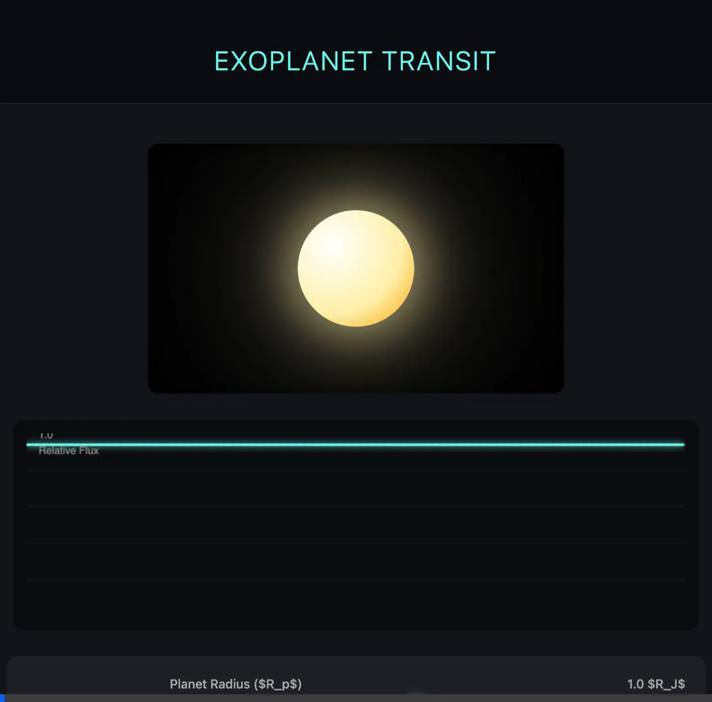

# 🪐 The Viltrumite Dream : Exoplanet Classification


Welcome to **The Viltrumite Dream**, an end-to-end machine learning pipeline built to classify Kepler Objects of Interest (KOIs) as either **Confirmed Exoplanets** or **False Positives**. 
A tribute to the Invincible Series < The Viltrumite Empire Finding a suitable planet to conquer >

## ✨ Features

- **Automated Data Ingestion**: Downloads the latest cumulative KOI dataset directly from the NASA Exoplanet Archive API.
- **Exploratory Data Analysis**: Clean, structured Jupyter notebooks for feature engineering and class imbalance analysis.
- **XGBoost Classification**: A high-performance Gradient Boosted model achieving **>99% PR-AUC**.
- **Interactive Transit Simulation**: A vanilla HTML/JS visualizer mimicking a planetary transit across a host star.

---

## 🚀 Interactive Simulation

I've built a live, interactive transit simulation that visually calculates relative flux drops ($\Delta F / L \approx (R_p / R_*)^2$) in real-time. You can adjust the **Planet Size** and **Orbital Speed** live to see how it affects the light curve!

👉 **To view**: Simply drag and drop `docs/index.html` into your web browser, or launch a local live server.



---

## 📁 Project Structure

```text
├── data/                  # Raw and cleaned datasets (NASA Exoplanet Archive)
├── docs/                  # Documentation and the HTML transit simulation
├── models/                # Serialized machine learning models (.pkl)
├── notebooks/             # EDA and visualization notebooks
├── src/
│   ├── download_data.py   # Script to pull NASA data
│   ├── train.py           # Model training pipeline
│   └── predict.py         # Inference script for new data
├── requirements.txt       # Project dependencies
└── README.md
```

## 🛠️ Quick Start

1. **Set up the environment**:
   ```bash
   python3 -m venv .venv
   source .venv/bin/activate
   pip install -r requirements.txt
   ```

2. **Download the Data**:
   ```bash
   python src/download_data.py
   ```

3. **Run the EDA**:
   Execute `notebooks/01_eda.ipynb` to clean the dataset and generate `data/cleaned.csv`.

4. **Train the Model**:
   ```bash
   python src/train.py
   ```
   *This outputs a confusion matrix to `docs/` and saves the model.*

5. **Run Predictions**:
   ```bash
   python src/predict.py
   ```

## 📊 Model Performance

Our XGBoost model effectively handles class imbalance utilizing dynamic `scale_pos_weight` tuning. It achieves a near-perfect Precision-Recall AUC of **0.9995** by leveraging fundamental transit features such as orbital period (`koi_period`) and transit duration (`koi_duration`).

---
*Built with 💝 for astronomy and data science.*
